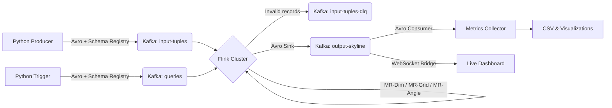

<div align="center">
  
# Distributed Skyline Query Processing
**High-performance, real-time dominance analysis on high-volume data streams.**

[](https://www.oracle.com/java/technologies/javase-jdk11-downloads.html) [](https://flink.apache.org/) [](https://kafka.apache.org/)  [](https://avro.apache.org/) [](https://www.docker.com/) [](https://opensource.org/licenses/MIT)

An Apache Flink and Kafka streaming project developed at the Technical University of Crete (COMP 622: Special Topics in Databases).

[Architecture](#architecture) • [Features](#features) • [Getting Started](#getting-started) • [Deployment](#deployment) • [Usage](#usage) • [Changelog](#changelog) • [License](#license)

</div>

---

## Overview

This project implements three partitioning strategies (**MR-Dim**, **MR-Grid**, **MR-Angle**) using the Flink DataStream API to efficiently compute Skyline queries in a distributed environment. It processes high-throughput data streams ingested via Apache Kafka in real-time using **Avro serialization** through Confluent Schema Registry, allowing scalable, continuous multi-dimensional dominance analysis.

## Features

The project is built on Apache Flink 1.20.0 to provide fault-tolerant, scalable, and low-latency stream processing. The system offers three distinct partitioning strategies for handling data: **MR-Dim** leverages dimension-based partitioning, **MR-Grid** relies on grid-based partitioning, and **MR-Angle** utilizes angle-based partitioning.

A containerized infrastructure enables a one-command setup using Docker Compose to orchestrate Kafka (KRaft mode, no Zookeeper), Confluent Schema Registry, and the Flink cluster (JobManager + TaskManager).

Additionally, the repository provides built-in Python scripts acting as synthetic data generators that can produce **Uniform**, **Correlated**, and **Anti-Correlated** datasets. Automated benchmarking and visualization are handled by real-time metrics collection scripts and rich Python-based graphing tools. A live React/TypeScript dashboard is also included for real-time result streaming.

## Architecture



## Repository Structure

```text
.
├── deploy/                     # Docker Compose infrastructure & properties config
│   ├── docker-compose.yml
│   └── config.properties
├── docs/                       # Project documentation, guides, and specifications
│   ├── setup/
│   │   └── ubuntu_setup.md
│   └── project_documentation.pdf
├── src/
│   └── main/
│       ├── avro/               # Avro schemas (service_tuple, query_trigger, skyline_result)
│       └── java/org/main/      # Flink streaming application source (FlinkSkyline.java)
├── python/                     # Python producers, benchmarks, and graphing scripts
│   ├── src/                    # Data producers, websocket bridge, and metrics collectors
│   │   ├── kafka_producer.py
│   │   ├── metrics_collector.py
│   │   ├── query_trigger.py
│   │   ├── unified_producer.py
│   │   └── websocket_bridge.py
│   ├── benchmarks/             # Benchmark execution and testing
│   │   ├── run_benchmark.py
│   │   └── test_generators.py
│   └── visualization/          # Performance plots and data graphing scripts
│       ├── graph_ingestion_parallelism.py
│       ├── graph_paper_figures.py
│       ├── graph_performance_by_dimension.py
│       └── graph_skyline_points_2d.py
├── dashboard/                  # React + TypeScript live results dashboard (Vite)
├── requirements.txt            # Python dependencies (global reference)
├── start.ps1                   # Project one-click deployment & launcher script
└── pom.xml                     # Maven build file
```

---

## Getting Started

### Prerequisites

Ensure you have the following installed on your system:
- **Docker** and **Docker Compose**
- **Java 11** and **Maven**
- **Python 3.x**
- **Node.js** (optional for live dashboard)

Install all required Python dependencies using the provided requirements file:

```bash
pip install -r requirements.txt
```

### Build the Flink Job

From the **project root** (where `pom.xml` is located), package the Flink application into a fat JAR:

```bash
mvn clean package
```

The compiled JAR will be at `target/Skyline-Project-Flink-1.0-SNAPSHOT.jar`. This file is automatically volume-mounted into the Flink Docker containers by `deploy/docker-compose.yml`.

---

## Deployment

### 1. Infrastructure Deployment

Deploy Kafka, Schema Registry, and the Flink cluster using Docker Compose:

```bash
cd deploy
docker-compose up -d
```

Or run the one-click PowerShell launcher from the project root:
```powershell
.\start.ps1
```

Verify that all four services are running:

```bash
docker ps
```

You should see:

| Container | Purpose | Host Port |
|---|---|---|
| `kafka` | Message broker (KRaft mode) | `9092` |
| `schema-registry` | Avro schema management | `8082` |
| `flink-jobmanager` | Flink coordinator UI | `8081` |
| `flink-taskmanager` | Flink worker (4 task slots) | — |


Access the **Flink Web UI** at [http://localhost:8081](http://localhost:8081).

### 2. Job Deployment

#### Option A: Via Flink Web UI

1. Open [http://localhost:8081](http://localhost:8081)
2. Click **Submit New Job** → **Add New**
3. Upload `target/Skyline-Project-Flink-1.0-SNAPSHOT.jar`
4. Click the uploaded JAR and click **Submit**

The job reads its runtime parameters from `deploy/config.properties`, which is volume-mounted at `/opt/flink/usrlib/config.properties` inside the containers.

#### Option B: Via IntelliJ IDEA (Local Dev)

Run `FlinkSkyline.java` directly from the IDE. Set program arguments in **Edit Configurations → Program arguments**, e.g.:

```
--algorithm mr-angle --parallelism 4 --bootstrap-servers localhost:9092 --schema-registry-url http://localhost:8082
```

---

## Usage

### 1. Start the Metrics Collector

Open a terminal in the **project root** and run before streaming any data:

```bash
python python/src/metrics_collector.py results.csv
```

This listens on the `output-skyline` Kafka topic and appends results to `results.csv`. Leave this running.

### 2. Run the Data Generator

Open another terminal in the **project root**:

```bash
# Syntax: python python/src/unified_producer.py <topic> <distribution> <dims> <min> <max> <query_topic>
python python/src/unified_producer.py input-tuples anti_correlated 3 0 10000 queries
```

Supported distributions: `uniform`, `correlated`, `anti_correlated`.

The producer automatically fires a query trigger every **1,000,000 records**. To trigger a query manually at any time:

```bash
python python/src/query_trigger.py queries mr-angle 60
```

### 3. Run Automated Benchmarks

Instead of running data generation and Flink jobs manually, you can execute the automated benchmarking suite. It handles Flink job submission, topic recreation, ingestion rate-limiting, and multiple measured trials with isolated JVM warmups. It also snapshots peak TaskManager CPU/memory resource utilization via Docker stats.

Run from the **project root**:
```bash
# Run a quick verification benchmark (1 configuration, 1 trial)
python python/benchmarks/run_benchmark.py --fast

# Run a customized fast sweep (e.g. only 2D, 2 trials, 1 warmup)
python python/benchmarks/run_benchmark.py --dims 2 --parallelisms 2,4 --trials 2 --warmups 1

# Run the full sweep (Warning: parallelisms 1,2,4 & dimensions 2,3,4 - takes ~80 mins)
python python/benchmarks/run_benchmark.py
```
Detailed logs are written dynamically to `benchmark_results.csv`.

### 4. Visualize Results

Once `results.csv` or `benchmark_results.csv` has data:

| Script | Command | Output |
|---|---|---|
| Skyline 2D plot | `python python/visualization/graph_skyline_points_2d.py results.csv -1` | `skyline_viz_-1.png` |
| Performance dashboard | `python python/visualization/graph_ingestion_parallelism.py MR-Angle=results.csv` | `performance_analysis.png` |
| Paper figures | `python python/visualization/graph_paper_figures.py` | `figure_5_replication.png`, `figure_7_replication.png` |
| By-dimension comparison | `python python/visualization/graph_performance_by_dimension.py` | `performance_plots.png` |

### 5. Live Dashboard (Optional)

Start the WebSocket bridge (connects Kafka output to the dashboard):

```bash
python python/src/websocket_bridge.py
```

Then, in a separate terminal, start the React dashboard:

```bash
cd dashboard
npm install   # first time only
npm run dev
```

Navigate to `http://localhost:5173` to view live results as they stream in.

## Teardown

```bash
cd deploy
docker-compose down
```

---

## Changelog

### v1.1.0
- Reorganized codebase into clean structured folders (`deploy/`, `docs/`, `python/src/`, `python/benchmarks/`, `python/visualization/`).
- Fixed Docker internal networking: Flink now connects to Kafka via `kafka:29092` and Schema Registry via `schema-registry:8081`.
- Added `schema-registry-url` key to `config.properties`.
- Replaced deprecated FastAPI `@app.on_event("startup")` with `lifespan` context manager in `websocket_bridge.py`.
- Fixed `graph_performance_by_dimension.py` to no longer execute plots at module import time.
- Fixed `graph_paper_figures.py` y-axis label (milliseconds, not seconds).
- Updated Python install instructions to use `pip install -r requirements.txt`.
- Corrected Maven build path (project root, not non-existent `java/` directory).
- Updated architecture diagram to include Schema Registry, DLQ topic, and WebSocket bridge.
- Bumped version badges to Flink 1.20.0 and Kafka 3.7.2.

### v1.0.0
- Initial implementation of distributed skyline query processing using Apache Flink.
- Added MR-Dim, MR-Grid, and MR-Angle partitioning strategies.
- Containerized Kafka and Flink cluster using Docker Compose.
- Implemented Python-based data generators and metrics collectors.
- Added Python scripts for performance visualization.

---

## License

This project is licensed under the MIT License. See the [LICENSE](LICENSE) file for more details.

---

## Authors

| [<br /><sub><b>Asterinos1</b></sub>](https://github.com/Asterinos1) | [<br /><sub><b>eNiaro</b></sub>](https://github.com/eNiaro) |
| :---: | :---: |

Developed for COMP 622: Special Topics in Databases at the Technical University of Crete.
